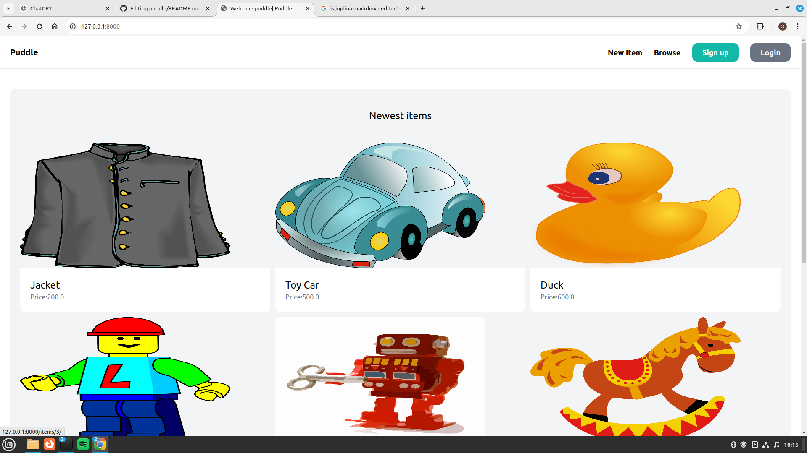
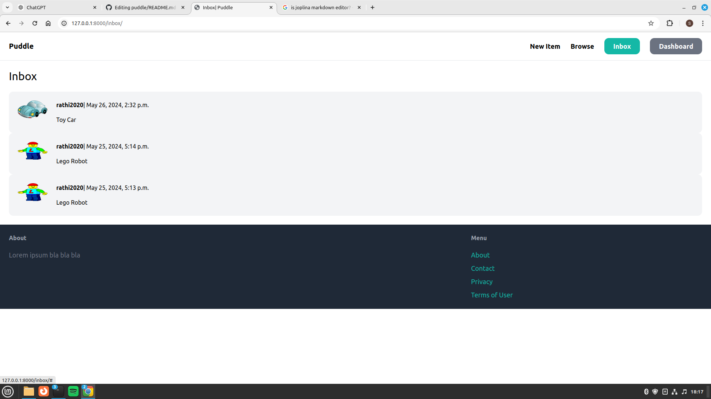
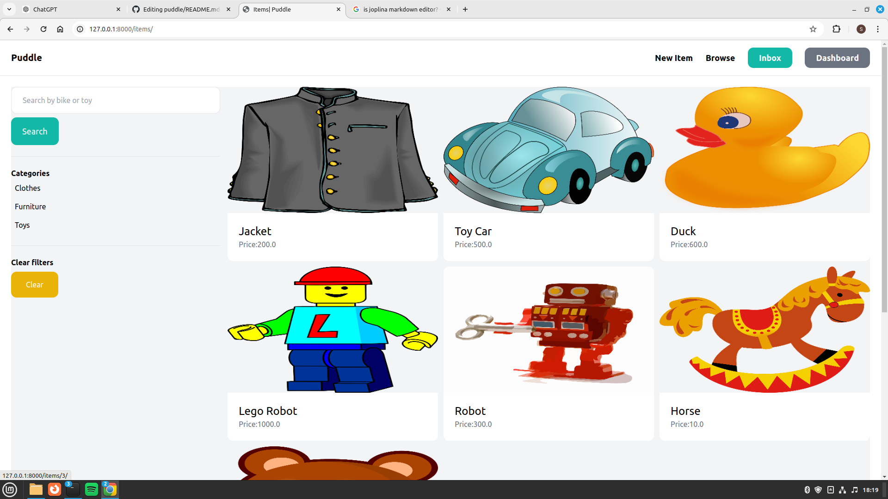
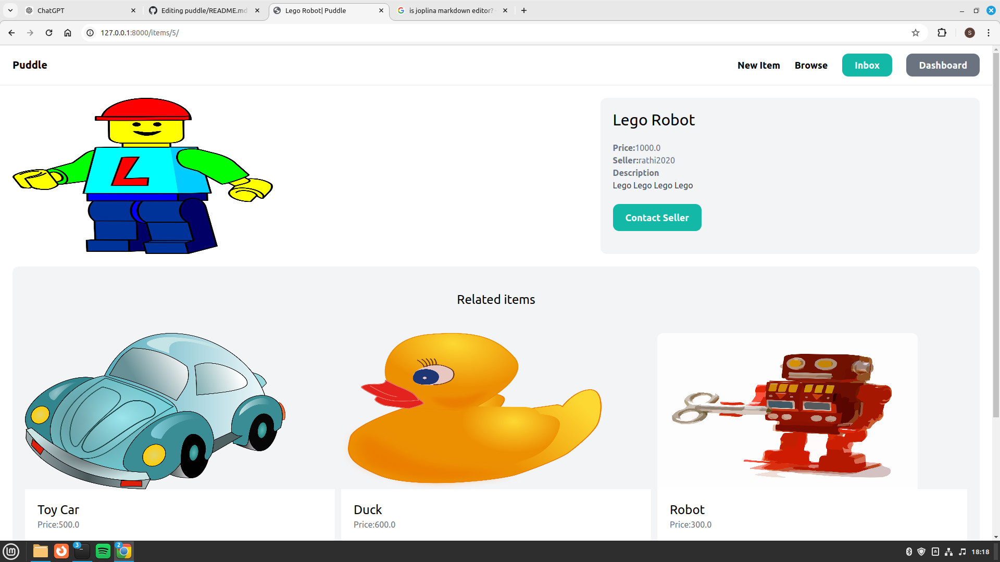

# puddle
This is a personal project created from [this video](https://youtu.be/ZxMB6Njs3ck?si=aho66g2g3WHXT76N).

# Running Project
To run this project, run the following commands in your terminal:
```bash
git clone https://github.com/sudiptarathi2020/puddle.git
cd puddle
python3 manage.py runserver
```

# Contribution
If you want to contribute, clone this repository and made a pull request.Request will be accepted based on quality of work and my personal preference.

# Some Screenshots
<figure style="margin-bottom: 50px;">
  
  
</figure>
<br>
<figure style="margin-bottom: 50px;">
  

</figure>
<br>
<figure style="margin-bottom: 50px;">
  
  
</figure>
<br>
<figure style="margin-bottom: 50px;">
  
 
</figure>

